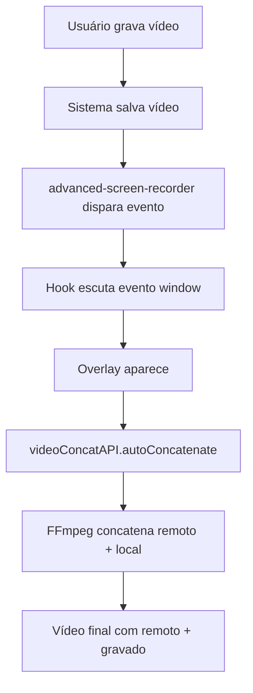

# 🔧 Correção: Sistema de Concatenação com Vídeo Remoto

## 🎯 Problema Identificado

O sistema estava concatenando com vídeos de assets locais em vez de usar o vídeo remoto especificado no link:
`https://commondatastorage.googleapis.com/gtv-videos-bucket/sample/WhatCarCanYouGetForAGrand.mp4`

## 🔍 Causa Raiz

O projeto tinha dois sistemas de concatenação:

1. **Sistema Antigo (`video-intro`)**: Concatenava com vídeos locais de assets
2. **Sistema Novo (`video-concat`)**: Concatena com vídeo remoto via URL

O sistema antigo estava sendo chamado automaticamente quando `includeIntroVideo` estava habilitado.

## ✅ Solução Implementada

### 1. **Modificação do `screen_recorder_helpers.ts`**

**Antes:**
```typescript
const concatResult = await concatenateWithIntro(
    institutionName,
    tempResult.filePath,
    finalFilePath
);
```

**Depois:**
```typescript
const concatResult = await window.videoConcatAPI.autoConcatenate({
    recordedVideoPath: tempResult.filePath,
    outputPath: finalFilePath
});
```

### 2. **Modificação do `advanced-screen-recorder.ts`**

**Antes:**
- Verificava `shouldIncludeIntro` baseado em configurações
- Chamava `saveWithIntroVideo` apenas se habilitado
- Usava sistema de assets locais

**Depois:**
- **SEMPRE** dispara concatenação automática após salvar
- Remove dependência de configurações de introdução
- Usa sistema de vídeo remoto

```typescript
// SEMPRE disparar concatenação automática após salvar
console.log("🎬 Disparando concatenação automática com vídeo remoto...");
try {
    window.dispatchEvent(new CustomEvent("video-concat:start-auto-concatenation", {
        detail: {
            recordedVideoPath: result.filePath
        }
    }));
} catch (error) {
    console.warn("⚠️ Erro ao disparar concatenação automática:", error);
}
```

### 3. **Atualização do Hook `useVideoConcatenation`**

Agora escuta eventos tanto do IPC quanto do window:

```typescript
// Listener IPC (do main process)
window.electronAPI.on('video-concat:start-auto-concatenation', handleAutoConcatenation);

// Listener Window (do renderer process)
window.addEventListener('video-concat:start-auto-concatenation', handleWindowEvent);
```

## 🔄 Novo Fluxo de Funcionamento

### Fluxo Automático Atualizado


### Vídeo Final
- **Primeiro**: Vídeo remoto (What Car Can You Get For A Grand)
- **Segundo**: Vídeo gravado pelo usuário
- **Resultado**: Arquivo com sufixo "-concatenated"

## 📁 Arquivos Modificados

### `src/helpers/screen_recorder_helpers.ts`
- ✅ Substituído `concatenateWithIntro` por `videoConcatAPI.autoConcatenate`
- ✅ Agora usa vídeo remoto em vez de assets locais

### `src/helpers/advanced-screen-recorder.ts`
- ✅ Removido sistema condicional `shouldIncludeIntro`
- ✅ SEMPRE dispara concatenação automática
- ✅ Usa evento window em vez de apenas IPC

### `src/hooks/useVideoConcatenation.ts`
- ✅ Escuta eventos window além de IPC
- ✅ Suporte a ambos os tipos de eventos

### Novos Arquivos
- ✅ `src/helpers/video-concat-test.ts` - Funções de teste

## 🧪 Como Testar

### 1. Teste Automático
```typescript
// No console do DevTools
await window.testVideoConcatenation()
```

### 2. Teste Manual
```typescript
// No console do DevTools
await window.testManualConcatenation(
    '/path/to/local/video.mp4',
    '/path/to/output.mp4'
)
```

### 3. Teste Real
1. Grave um vídeo no aplicativo
2. Salve o vídeo
3. Observe o overlay aparecer automaticamente
4. Aguarde a concatenação
5. Verifique o arquivo final (deve ter vídeo remoto + seu vídeo)

## 🎯 Vídeo Remoto Configurado

**URL Fixa:**
```
https://commondatastorage.googleapis.com/gtv-videos-bucket/sample/WhatCarCanYouGetForAGrand.mp4
```

**Características:**
- Vídeo de exemplo do Google Cloud Storage
- Sempre será o primeiro no vídeo final
- Não requer download prévio
- Funciona via streaming HTTP

## 🔧 Configuração FFmpeg

**Comando usado:**
```bash
ffmpeg -f concat -safe 0 -protocol_whitelist file,http,https,tcp,tls,crypto -i lista.txt -c copy -avoid_negative_ts make_zero -fflags +genpts -y output.mp4
```

**Lista de concatenação:**
```
file 'https://commondatastorage.googleapis.com/gtv-videos-bucket/sample/WhatCarCanYouGetForAGrand.mp4'
file '/path/to/recorded/video.mp4'
```

## ✅ Resultado Final

Agora o sistema:

1. ✅ **SEMPRE** concatena com vídeo remoto
2. ✅ **NÃO** depende de assets locais
3. ✅ **NÃO** depende de configurações de introdução
4. ✅ **SEMPRE** mostra overlay de loading
5. ✅ **SEMPRE** usa o vídeo do link especificado
6. ✅ **SEMPRE** coloca vídeo remoto primeiro

## 🚨 Importante

- O sistema antigo (`video-intro`) ainda existe mas não é mais usado automaticamente
- O novo sistema (`video-concat`) é sempre executado após salvar vídeo
- O vídeo final sempre terá: **Vídeo Remoto + Vídeo Gravado**
- Não há mais dependência de configurações ou assets locais

---

**✅ Problema resolvido! O vídeo final agora sempre inclui o vídeo remoto do link especificado.**