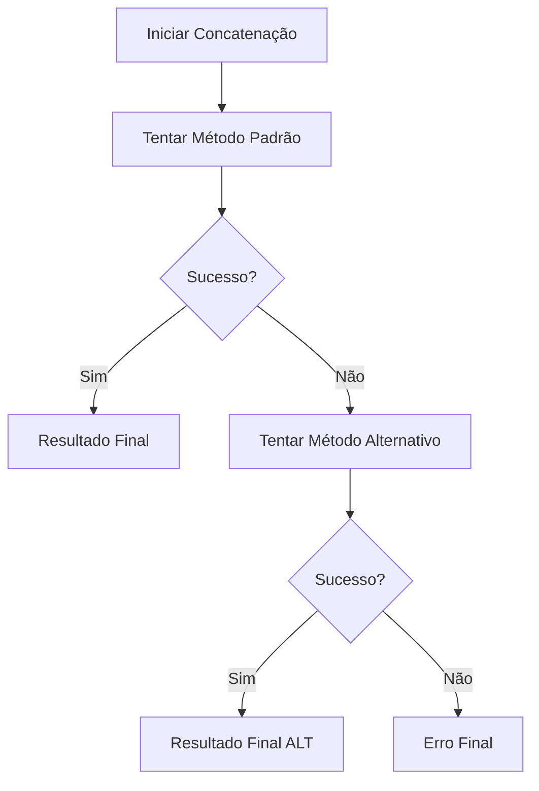

# 🔧 Métodos de Concatenação de Vídeos

## 🚨 Problema Identificado
O vídeo gravado não aparece no resultado final, apenas o vídeo da URL.

## 🛠️ Soluções Implementadas

### 1. **Método Padrão (Melhorado)**
- ✅ Usa arquivo de lista (`concat` demuxer)
- ✅ Recodifica para garantir compatibilidade
- ✅ Normaliza resolução e frame rate
- ✅ Logs detalhados para debug

**Comando:**
```bash
ffmpeg -f concat -safe 0 -protocol_whitelist file,http,https,tcp,tls,crypto -i lista.txt -c:v libx264 -c:a aac -preset medium -crf 23 -r 30 -vf scale=1920:1080:force_original_aspect_ratio=decrease,pad=1920:1080:(ow-iw)/2:(oh-ih)/2 -avoid_negative_ts make_zero -fflags +genpts -movflags +faststart -y output.mp4
```

### 2. **Método Alternativo (Novo)**
- ✅ Usa inputs diretos (sem arquivo de lista)
- ✅ Usa filtro complexo `concat`
- ✅ Mais robusto para vídeos diferentes
- ✅ Fallback automático se o primeiro falhar

**Comando:**
```bash
ffmpeg -i URL_REMOTA -i VIDEO_LOCAL -filter_complex '[0:v][0:a][1:v][1:a]concat=n=2:v=1:a=1[outv][outa]' -map '[outv]' -map '[outa]' -c:v libx264 -c:a aac -preset medium -crf 23 -movflags +faststart -y output.mp4
```

## 🔍 Melhorias de Debug

### Verificações Adicionadas:
1. **Arquivo gravado existe?**
2. **Tamanho do arquivo > 0?**
3. **Informações detalhadas do arquivo**
4. **Logs do FFmpeg em tempo real**
5. **Comando completo executado**

### Logs Esperados:
```
📊 Informações do arquivo gravado:
📊   Caminho: /path/to/video.mp4
📊   Tamanho: 15.23 MB
📊   Criado em: 2024-01-01T10:00:00.000Z
📊   Modificado em: 2024-01-01T10:00:00.000Z

📝 ORDEM DOS VÍDEOS:
📝   1º - Vídeo REMOTO (URL): https://...
📝   2º - Vídeo GRAVADO (local): /path/to/video.mp4

🔧 Comando completo: /path/to/ffmpeg -i URL -i LOCAL ...

📋 Info FFmpeg: Input #0, mov,mp4,m4a,3gp,3g2,mj2, from 'https://...'
📋 Info FFmpeg: Input #1, mov,mp4,m4a,3gp,3g2,mj2, from '/path/to/video.mp4'
📊 Progresso: frame= 1234 fps=30 q=23.0 size= 5120kB time=00:00:41.13 bitrate=1019.2kbits/s speed=1.2x
```

## 🎯 Fluxo de Fallback



## 🧪 Como Testar

### 1. **Verificar Logs**
Após gravar um vídeo, observe no console:
- Informações do arquivo gravado
- Ordem dos vídeos
- Comando FFmpeg executado
- Progresso da concatenação

### 2. **Testar Método Específico**
```javascript
// Método padrão
await window.videoConcatAPI.autoConcatenate({
  recordedVideoPath: '/path/to/video.mp4'
});

// Método alternativo
await window.videoConcatAPI.autoConcatenateAlt({
  recordedVideoPath: '/path/to/video.mp4'
});
```

## 🔧 Possíveis Causas do Problema

### 1. **Formato Incompatível**
- Vídeo remoto: H.264/AAC
- Vídeo gravado: Pode ser WebM/VP8
- **Solução**: Recodificação forçada

### 2. **Resolução Diferente**
- Vídeo remoto: 1280x720
- Vídeo gravado: 1920x1080
- **Solução**: Normalização de resolução

### 3. **Frame Rate Diferente**
- Vídeo remoto: 24fps
- Vídeo gravado: 30fps
- **Solução**: Normalização para 30fps

### 4. **Codec de Áudio**
- Vídeo remoto: AAC
- Vídeo gravado: Opus/Vorbis
- **Solução**: Recodificação para AAC

### 5. **Timestamps**
- Problemas com timestamps negativos
- **Solução**: `-avoid_negative_ts make_zero`

## 🎯 Próximos Passos

1. **Executar teste** e verificar logs
2. **Identificar** qual método funciona
3. **Analisar** logs do FFmpeg para erros específicos
4. **Ajustar** parâmetros se necessário

## 📋 Checklist de Debug

- [ ] Arquivo gravado existe e tem tamanho > 0
- [ ] Logs mostram ordem correta dos vídeos
- [ ] FFmpeg reconhece ambos os inputs
- [ ] Não há erros durante o processamento
- [ ] Arquivo final é criado com tamanho > 0
- [ ] Arquivo final contém ambos os vídeos

---

**Agora o sistema tem dois métodos robustos e logs detalhados para identificar exatamente onde está o problema!**