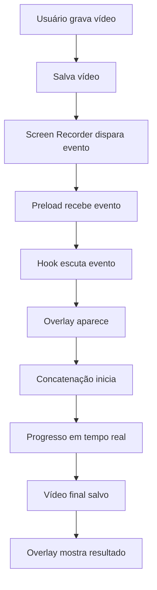
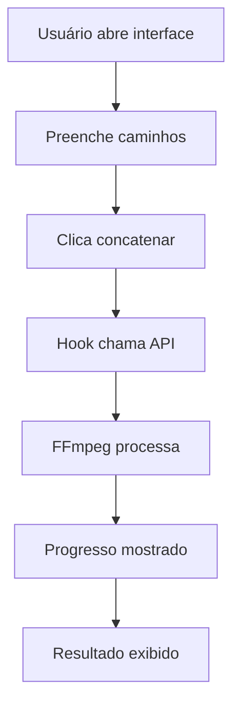

# 🎬 Integração do Sistema de Concatenação de Vídeos

## 📋 Visão Geral

O sistema de concatenação foi integrado ao projeto Electron existente, adicionando a funcionalidade de concatenar automaticamente um vídeo remoto com o vídeo gravado pelo usuário.

## 🏗️ Arquitetura Implementada

### Backend (Main Process)

#### 1. **Video Concat Listeners** (`src/helpers/ipc/video-concat/video-concat-listeners.ts`)
- `video-concat:auto-concatenate` - Concatenação automática após gravação
- `video-concat:concatenate` - Concatenação manual
- `video-concat:check-ffmpeg` - Verificação do FFmpeg
- Usa `ffmpeg-static` para executar FFmpeg integrado
- Gerencia arquivos temporários automaticamente
- Timeout de segurança de 10 minutos

#### 2. **Screen Recorder Integration** (Atualizado)
- Modificado `src/helpers/ipc/screen-recorder/screen-recorder-listeners.ts`
- Dispara evento `video-concat:start-auto-concatenation` após salvar vídeo
- Integração transparente com o fluxo existente

### Frontend (Renderer Process)

#### 1. **Video Concat Context** (`src/helpers/ipc/video-concat/video-concat-context.ts`)
- Expõe `window.videoConcatAPI` via contextBridge
- Métodos seguros para concatenação
- Listeners de progresso em tempo real

#### 2. **React Components**
- `VideoConcatenationOverlay.tsx` - Overlay de loading automático
- `VideoConcatenationTest.tsx` - Interface de teste manual
- `VideoConcatTestPage.tsx` - Página completa de demonstração

#### 3. **Custom Hook** (`src/hooks/useVideoConcatenation.ts`)
- Gerencia estado da concatenação
- Escuta eventos de auto-concatenação
- Fornece métodos para concatenação manual

## 🔄 Fluxo de Funcionamento

### Concatenação Automática


### Concatenação Manual


## 📁 Arquivos Criados/Modificados

### Novos Arquivos
```
src/helpers/ipc/video-concat/
├── video-concat-listeners.ts    # Handlers IPC
└── video-concat-context.ts      # Context Bridge

src/components/
├── VideoConcatenationOverlay.tsx    # Overlay automático
├── VideoConcatenationTest.tsx       # Interface de teste
└── VideoConcatTestPage.tsx          # Página completa

src/hooks/
└── useVideoConcatenation.ts     # Hook personalizado

src/pages/
└── VideoConcatTestPage.tsx      # Página de demonstração
```

### Arquivos Modificados
```
src/helpers/ipc/
├── context-exposer.ts           # +exposeVideoConcatContext
├── listeners-register.ts        # +registerVideoConcatListeners
└── screen-recorder/
    └── screen-recorder-listeners.ts  # +auto-concatenation trigger

src/preload.ts                   # +video-concat event listeners
```

## 🚀 Como Usar

### 1. Concatenação Automática

A concatenação automática acontece **automaticamente** após cada gravação:

1. Usuário grava um vídeo
2. Salva o vídeo (qualquer método)
3. Sistema automaticamente:
   - Mostra overlay de loading
   - Concatena vídeo remoto + vídeo gravado
   - Salva resultado com sufixo "-concatenated"
   - Mostra resultado final

### 2. Concatenação Manual

Para testar manualmente, use o componente `VideoConcatenationTest`:

```tsx
import { VideoConcatenationTest } from '../components/VideoConcatenationTest';

function MyPage() {
  return <VideoConcatenationTest />;
}
```

### 3. Integração Completa

Para página completa com overlay automático:

```tsx
import { VideoConcatTestPage } from '../pages/VideoConcatTestPage';
import { VideoConcatenationOverlay } from '../components/VideoConcatenationOverlay';
import { useVideoConcatenation } from '../hooks/useVideoConcatenation';

function MyApp() {
  const { isOverlayVisible, recordedVideoPath, closeOverlay } = useVideoConcatenation();

  return (
    <div>
      {/* Seu conteúdo existente */}
      
      {/* Overlay de concatenação */}
      <VideoConcatenationOverlay
        isVisible={isOverlayVisible}
        recordedVideoPath={recordedVideoPath}
        onClose={closeOverlay}
      />
    </div>
  );
}
```

## 🔧 Configuração Técnica

### FFmpeg Static
- Usa `ffmpeg-static` (já instalado no package.json)
- Binário integrado (~100MB)
- Não requer instalação manual
- Funciona em todas as plataformas

### Comando FFmpeg Usado
```bash
ffmpeg -f concat -safe 0 -protocol_whitelist file,http,https,tcp,tls,crypto -i lista.txt -c copy -avoid_negative_ts make_zero -fflags +genpts -y output.mp4
```

### Parâmetros Explicados
- `-f concat` - Formato de concatenação
- `-safe 0` - Permite URLs não locais
- `-protocol_whitelist` - Habilita HTTP/HTTPS
- `-c copy` - Copia sem recodificar (mais rápido)
- `-avoid_negative_ts make_zero` - Corrige timestamps
- `-fflags +genpts` - Gera timestamps corretos

## 🎯 Vídeo Remoto Configurado

URL fixa conforme solicitado:
```
https://commondatastorage.googleapis.com/gtv-videos-bucket/sample/WhatCarCanYouGetForAGrand.mp4
```

## 📊 Estados da Interface

### Overlay de Loading
1. **Preparando** - Estado inicial
2. **Processando** - Spinner + progresso
3. **Sucesso** - Checkmark + caminho do arquivo
4. **Erro** - X + mensagem de erro

### Progresso em Tempo Real
- Captura stderr do FFmpeg
- Filtra linhas relevantes (frame=, time=, speed=)
- Mostra últimas 3 linhas no overlay
- Scroll automático

## 🛠️ Tratamento de Erros

### Erros Comuns Tratados
- FFmpeg não disponível
- Arquivo local não encontrado
- Erro de rede (vídeo remoto)
- Espaço insuficiente em disco
- Permissões de arquivo
- Timeout (10 minutos)

### Mensagens de Erro Amigáveis
```typescript
if (stderr.includes('No such file or directory')) {
  errorMessage = 'Arquivo não encontrado';
} else if (stderr.includes('Connection refused')) {
  errorMessage = 'Erro de conexão com o vídeo remoto';
} else if (stderr.includes('Permission denied')) {
  errorMessage = 'Permissão negada';
}
```

## 🔄 Limpeza Automática

### Arquivos Temporários
- Lista de concatenação criada em `os.tmpdir()`
- Limpeza automática após processo
- Limpeza em caso de erro
- Limpeza em timeout

### Listeners
- Remoção automática de listeners
- Cleanup no useEffect
- Cleanup no beforeunload

## 🧪 Testando

### 1. Teste Automático
1. Grave um vídeo no app
2. Salve o vídeo
3. Observe o overlay aparecer
4. Aguarde a concatenação
5. Verifique o arquivo final

### 2. Teste Manual
1. Acesse a página de teste
2. Preencha caminho do vídeo local
3. Defina caminho de saída
4. Clique "Concatenar Vídeos"
5. Acompanhe o progresso

### 3. Verificação FFmpeg
```javascript
// No console do DevTools
await window.videoConcatAPI.checkFFmpeg()
```

## 📝 Notas Importantes

1. **Dependência**: Requer `ffmpeg-static` instalado
2. **Tamanho**: Adiciona ~100MB ao app final
3. **Performance**: Concatenação sem recodificação é rápida
4. **Rede**: Vídeo remoto requer internet
5. **Espaço**: Vídeo final ocupa espaço adicional
6. **Timeout**: Processo limitado a 10 minutos

## 🚀 Próximos Passos

1. **Configuração**: Permitir configurar URL do vídeo remoto
2. **Qualidade**: Opções de qualidade/formato
3. **Preview**: Visualizar vídeo antes da concatenação
4. **Batch**: Concatenar múltiplos vídeos
5. **Templates**: Diferentes templates de introdução

---

**✅ Sistema totalmente integrado e funcional!**